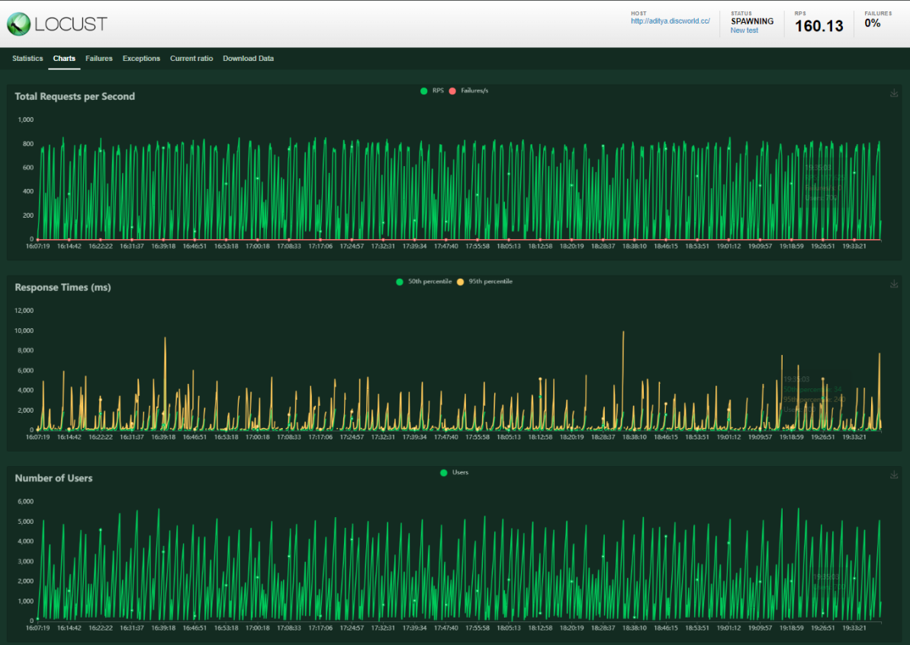

Real Time Data Simulation for Time Series Forecasting using Locust
---

This is a python script for setting up Real Time Simulation for User Traffic for an Application.
This script is a part of my Bachelor's Theses and is used to generate some test data required for Time Series forecasting.

The final script which was used for test data generation was `script4.py`.

  

